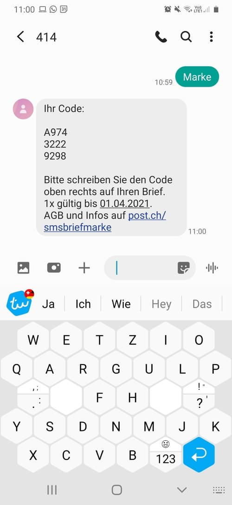

+++
title = "Briefmarken auf einfach"
date = "2021-03-22"
draft = false
pinned = false
tags = ["lernbegeistert"]
image = "marke2_1-1-.jpeg"
description = "Aktuell bin ich beruflich ziemlich eingespannt. Jede kleine Verbesserung meiner Prozesse daher sehr willkommen. Ich freue mich, hält auch der hektische Beufsalltag kleine Lernmomente bereit:"
+++
Briefmarken to go

Ein Ärgernis in meiner täglichen Arbeit sind die fehlenden Briefmarken. Öfter als mir lieb ist, muss ich etwas mit der Post verschicken. Das gekaufte Markenset reicht jeweils nicht sehr lange und der Gang zur Post kostet immer viel Zeit. So ist es mehrmals passiert, dass ich einen Brief versenden wollte und keine Marke hatte.

Neulich nun, habe ich die entsprechende Lösung gefunden. Man kann ganz easy ein SMS mit dem Text “Marke” an die Nummer 414 schicken. Im Handumdrehen erhält man einen Code, welcher auf das Couvert zu übertragen ist.

Ende Monat wird die Gebühr mittels Telefonrechnung abgerechnet. Einziger Wermutstropfen: Es lassen sich so nur A-Post Briefe verschicken.