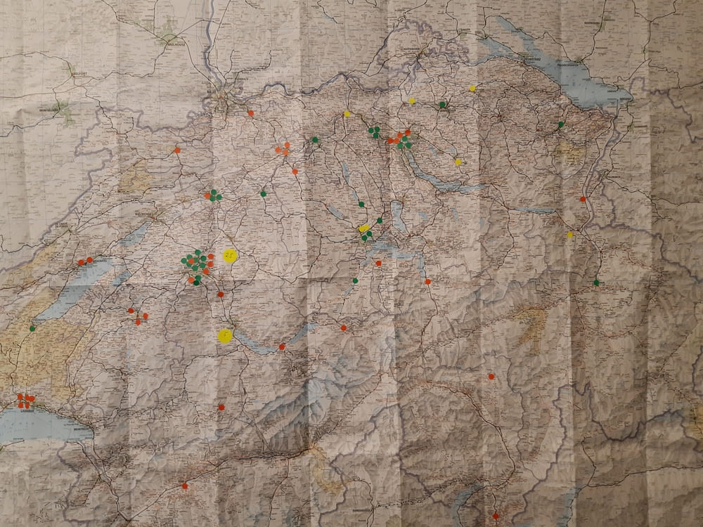

+++
title = "Lernen mit der Schweizer Armee"
date = "2020-12-19"
draft = false
pinned = false
tags = ["lernbegeistert"]
image = "20201218_084600-1-.jpg"
description = "Ueli Maurer hatte recht. Wir haben die beste Armee der Welt..."
+++

## Lernen mit der Schweizer Armee

Ueli Maurer hatte recht. Wir haben die beste Armee der Welt. Nicht weil sie unser Land so gut verteidigt oder gar abschreckend auf mögliche Feinde wirkt. Nein, dank der Schweizer Armee habe ich diese Woche so einiges über unser Land, deren Coworkinglandschaft und Arbeitstechnik gelernt. 

**Auftrag**

Anfangs 2021 plant die Armee einen Kaderrapport mit ca. 800 Teilnehmern. Da dieser nicht zentral abgehalten werden kann und aus inhaltlichen Gründen, werden die Teilnehmern in kleinen Gruppen, in Meetingräumen von Coworking Spaces in der ganzen Schweiz verteilt. Ich helfe mit dies zu organisieren.

**Geografie**

Wir verteilen die Gruppen unter Anderem nach Dienstorte. Diese sind häufig in Bern oder Zürich. Aber wir suchten auch Meetingräume in Mels, Buchs, Blénio, Grolley, Isone, Milvignes oder Zumwald. Nun kann ich diese Orte alle punktgenau (also fast) bestimmen. Fragt mich

**Coworkinglandschaft**

Wir haben über 100 Coworkingspaces gescreent und mit vielen telefoniert. Eine riesen Fülle an Kreativität und Inspiration. Gefühlt war es sofort ersichtlich ob der Space Business- oder Community getrieben war. Oder wie würdet ihr folgende Fragen / Aussagen zuordnen?

* “Das muss ich den Chef fragen”
* “Ich weiss noch nicht wie, aber das kriegen wir schon hin”
* “Nein, der Preis ist nicht verhandelbar”
* “Wir reservieren den Raum, wenn sie Formular XY unterschrieben haben”
* “Haben Sie denn Geld” (O-Ton, kein Witz)
* “Ah coole Sache, bei uns vis-a-vis hätte es auch noch eine gute Möglichkeit für euch”

Meine Highlights? [Hirschengraben](https://www.hirschengraben.org/) in Luzern weil super hilfsbereit und mitdenkend. [6280 ](https://www.6280.ch/de)ich meine, schaut euch mal den Space an und [Bockufoffice](https://www.bockufoffice.ch/) weil Name, Dialekt uns super freundlich.

**Arbeitstechnik**

Mittels einer Liste von CoWorkingSwitzerland und den Dienstorten haben wir die Spaces gescreent (sind Meetingräume vorhanden, hat es wirklich ein CoWorkingbereich). Danach telefonierten wir mit den Spaces um div. Dinge abzuklären (Einrichtung, Möglichkeit für Coworking Experience, Verpflegung usw.). Meist war dann immer noch irgendwelcher Schriftverkehr nötig. Dies nahm mega viel Zeit in Anspruch. Daher haben wir ab Tag zwei nach dem Screening zuerst ein ausführliches Mail mit der Bitte um Feedback (Offerte oder Absage) verschickt. So liess sich die Zeit pro Coworking Space etwas reduzieren. Ich denke pro Space, denn wir klar machen können benötigen wir knapp eine Stunde. Bin mega überrascht, dass das so viel ist. Wer hat Vorschläge, wie man das effizienter gestalten kann (nur so für das nächste Mal)? Tipps bitte an: [coworking.armee@effinger.ch](mailto:coworking.armee@effinger.ch)

Zwischenstand 18.12.2020, 12 Uhr: 

Screening: ca. 120

Offene Anfragen: 44

Fix gebucht: 33