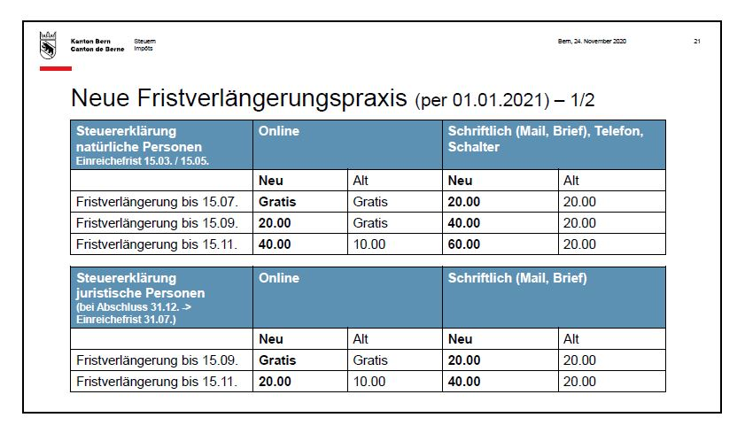

+++
title = "Neues aus der Steuerverwaltung"
date = "2020-12-08"
draft = true
pinned = false
tags = ["steuererklärungsausfüller"]
image = "pv.jpg"
description = "Letzte Woche besuchte ich ein Online Seminar der Steuerverwaltung des Kantons Bern. Neben vielem, welches mich oder meine Kunden weniger betrifft, waren folgende Punkte interessant:"
+++
Letzte Woche besuchte ich ein Online Seminar der Steuerverwaltung des Kantons Bern. Neben vielem, welches mich oder meine Kunden weniger betrifft, waren folgende Punkte interessant:

**Neue Praxis bei den Fristverlängerungen**

Bis anhin konnten zur Einreichung der Steuererklärung kostenlos eine Frist bis 15.09 beantragt werden (Ordentlicher Abgabetermin ist der 15.03). Diese konnte gegen eine Gebühr von CHF 10.00 nochmals bis am 15.11 verlängert werden.

Neu, ab 2021 (also Steuerperiode 2020) kann die Frist nur noch bis am 15.07 kostenlos verlängert werden. Anschliessend kostet es CHF 20.00 bis am 15.09 und CHF 40.00 bis am 15.11. Das heisst, dass der 15.11 weiterhin der letztmögliche Termin zur Einreichung der Steuererklärung bleibt.

Bei den juristischen Personen, hat sich nicht viel geändert. Hier ist es bis am 15.09 nach wie vor gratis (Ordentlicher Abgabetermin ist der 15.07). Neu kostet eine Verlängerung bis am 15.11 CHF 20.00 statt CHF 10.00

Gemäss ihren Angaben, erhält die Steuerverwaltung die ausgefüllten Erklärungen immer später im Jahr. Mit diesen Neuerungen erhofft sie sich eine etwas bessere Verteilung unter dem Jahr. Für mich heisst das, dass ich meine Kunden aktiv informieren werde und früher im Jahr nach den Unterlagen fragen werde.

**Photovoltaikanlagen**

Aufgrund eines [Bundesgerichtsentscheides](<(https://www.bger.ch/ext/eurospider/live/de/php/aza/http/index.php?highlight_docid=aza%3A%2F%2F16-09-2019-2C_510-2017&lang=de&type=show_document&zoom=YES&>) werden die additiven (Anlage wird auf bestehendes Dach montiert) PV-Anlagen nicht mehr zum Wert der Liegenschaft dazugezählt, sie zählen neu zum beweglichen Vermögen. Dementsprechend reduziert sich der Amtliche Wert und folglich auch der Eigenmietwert. Einnahmen aus diesen Anlagen werden neu als übriges Einkommen deklariert. Die Formulare ab 2020 werden um ein entsprechendes Feld ergänzt.

Dies zwei Neuerungen in aller Kürze. Bei weiteren Fragen stehe [ich](www.co-wing.ch) euch gerne zur Verfügung.